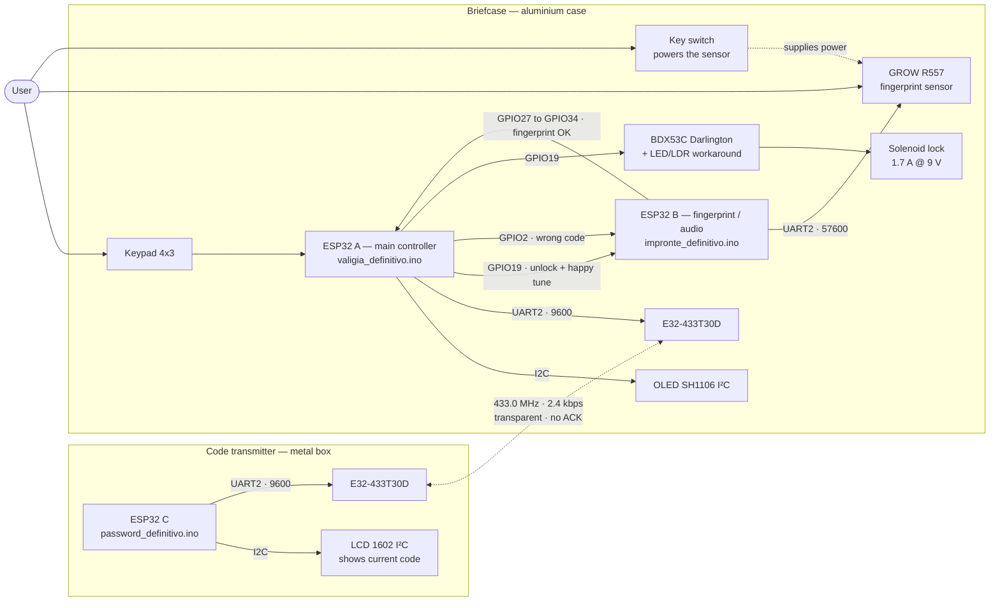
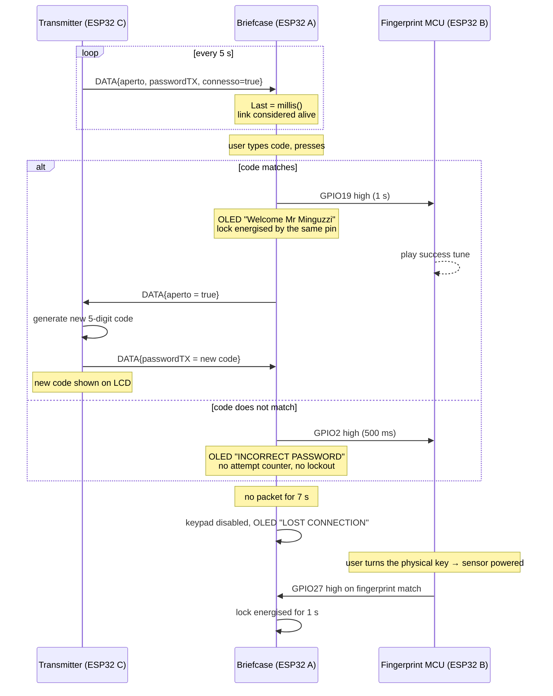

# Rolling-Code Briefcase

An ESP32 briefcase that unlocks with a one-time code delivered over a 433 MHz LoRa link, or
with a fingerprint when the radio link goes down. Built as a final high-school project in
2024 — documented honestly in 2026, mistakes included.

---

## Overview - Work it harder 👷🏻‍♂️

This was one of my final high-school projects. Looking back at it today there are several
things I would design differently, but it was also the first time I combined embedded
programming, wireless communication, biometrics, PCB design and hardware debugging into a
single system that had to actually work in front of an examination board.

The system is made of two physical units:

- **The briefcase.** An aluminium case containing two ESP32s on a custom PCB, a 4×3 keypad, an
  SH1106 OLED, a GROW R557 capacitive fingerprint sensor behind a key-operated switch, an
  EBYTE E32-433T30D LoRa module, two buzzers and a solenoid lock.
- **The code transmitter.** A separate metal box with a third ESP32, a 16×2 I²C LCD and a
  second E32-433T30D. It generates a new 5-digit code every time the briefcase is opened and
  displays it.

Enter the code shown on the transmitter, press `#`, the case opens and a fresh code is
generated. Walk out of radio range and the keypad goes dead: the OLED tells you to use the
fingerprint sensor instead, which only works once you have turned a physical key.

This repository is **not** a build guide for a secure product. It is a record of what I built with the knowledge available at the time, what actually worked, what did not.

> [!WARNING]
> **Do not use this to secure anything.** The unlock code is transmitted in clear text on a
> default LoRa address and channel, there is no attempt limit, and the radio module is
> configured for 1 W of output power, which is far above what is legal in the 433 MHz band in
> Europe. Details in [Security](#security-honestly) and [Disclaimer](#disclaimer).

---

## 📖 Table of Contents

*(There is toooooo much to scroll here click around instead.)*

- [Overview](#overview)
- [Background](#background)
- [Inspiration](#inspiration)
- [Features](#features)
- [System Architecture](#system-architecture)
  - [Data flow, as implemented](#data-flow-as-implemented)
- [Hardware](#hardware)
  - [Pin mapping](#pin-mapping)
- [Software](#software)
  - [Why three microcontrollers](#why-three-microcontrollers)
- [Authentication System](#authentication-system)
  - [Security, honestly](#security-honestly)
- [Wireless Communication](#wireless-communication)
  - [Correction: the frequency was 433.0 MHz, not 450 MHz](#correction-the-frequency-was-4330-mhz-not-450-mhz)
  - [Correction: the −148 dBm figure does not apply](#correction-the-148-dbm-figure-does-not-apply)
  - [Protocol](#protocol)
  - [The data structure — and the bug that never went off](#the-data-structure--and-the-bug-that-never-went-off)
  - [And a second one: no framing](#and-a-second-one-no-framing)
- [Range: what the report claimed, and what actually happened](#range-what-the-report-claimed-and-what-actually-happened)
  - [About the test table in the report](#about-the-test-table-in-the-report)
  - [Range was never the binding constraint](#range-was-never-the-binding-constraint)
  - [The failure shape is the clue](#the-failure-shape-is-the-clue)
  - [The other strong candidate: the radio was probably never transmitting 1 W](#the-other-strong-candidate-the-radio-was-probably-never-transmitting-1-w)
  - [Ranked, then](#ranked-then)
  - [The distinction I got wrong](#the-distinction-i-got-wrong)
- [Lock Control](#lock-control)
  - [Why the base drive could not work](#why-the-base-drive-could-not-work)
  - [The power supply was wrong too](#the-power-supply-was-wrong-too)
  - [What the lock actually ran on, in the end](#what-the-lock-actually-ran-on-in-the-end)
- [Original Workarounds](#original-workarounds)
  - [LED + photoresistor optocoupler](#led--photoresistor-optocoupler)
  - [Others](#others)
- [Power System](#power-system)
- [Custom PCB](#custom-pcb)
- [Known Issues and Limitations](#known-issues-and-limitations)
  - [On the fingerprint sensor "binding itself" to one ESP32](#on-the-fingerprint-sensor-binding-itself-to-one-esp32)
- [What I Would Do Differently Today](#what-i-would-do-differently-today)
- [Lessons Learned](#lessons-learned)
- [Repository Structure](#repository-structure)
- [How to Reproduce or Experiment with the Project](#how-to-reproduce-or-experiment-with-the-project)
- [Disclaimer](#disclaimer)
- [Credits and Inspiration](#credits-and-inspiration)
- [License](#license)

---
## Background

Italian high schools end with the *Esame di Stato*, and technical institutes expect (in 2024) a personal
project alongside the written exams. I wanted something that touched the disciplines that are the most interesting such as radio, embedded firmware, power electronics
and a board I had designed myself.

The case itself is my father's old aluminium attaché case, the kind with a three-digit
mechanical combination lock on the lid. That lock is still there and still works — everything
in this repository was added around it.

The original report is preserved, unedited, in
[`docs/original-report/`](docs/original-report/). It is in Italian, it is 33 pages long, and
parts of it are wrong. Rather than quietly correcting it, I have kept it as it was and written
[`docs/ORIGINAL_REPORT_REVIEW.md`](docs/ORIGINAL_REPORT_REVIEW.md), which goes through its
claims one by one and marks each as confirmed, imprecise, or wrong.

---

## Inspiration

The original idea came from this YouTube short:

**https://www.youtube.com/shorts/WOgwcFSCKto**

That video is where the concept of a remotely controlled locking case came from, and it
deserves the credit for the spark. It used an NRF24-based link and a
large LiPo pack of the kind used in airsoft replicas. My implementation went a different way
almost immediately: ESP32s instead of an arduino nano, EBYTE LoRa modules instead of NRF24, plus
biometric authentication and a custom PCB.

**What I was actually imagining** (to Make it better 💻🔨)

The honest answer to "why a briefcase" is that I was picturing something out of a spy film: a courier case carrying documents that must not be read,
which opens only for the right person, reports back the moment it is opened, and whose code changes every single time so that yesterday's code is worth nothing. 
An agency handler at one end, a courier at the other, and a radio link between them.

Nobody needed this. There were no classified documents. But that image is the reason every design decision felt obvious at the time — of course the code has to roll, 
of course the case has to report the moment it opens, of course there has to be a fallback for when the link is gone, of course there is a key.

I mention it because the fiction did real work. A vague brief — "build something with a microcontroller" — gets you a demo. 
A specific imagined scenario gives you requirements, and requirements are what let you tell a finished feature from an unfinished one.

---

## Features

- Rolling 5-digit unlock code, regenerated on every successful opening.
- 433 MHz point-to-point LoRa link between the case and a handheld code transmitter.
- Automatic fallback to fingerprint authentication when the radio link is lost for 7 seconds.
- A physical key switch that powers the fingerprint sensor, acting as a mechanical second factor.
- OLED feedback on the case, LCD display of the current code on the transmitter.
- Audible feedback: a click on every keypress, a rising tune on success, a falling one on failure.
- A custom two-layer PCB carrying both of the briefcase's ESP32s.

---

## System Architecture



### Data flow, as implemented



There is **no acknowledgement and no retry anywhere in this diagram**. If the "case opened"
packet is lost, the transmitter never generates a new code, the briefcase keeps the old one,
and neither side notices.

---

## Hardware

Full detail in [`docs/HARDWARE.md`](docs/HARDWARE.md); parts list in
[`docs/BOM.md`](docs/BOM.md).

| Function | Part | Notes |
|---|---|---|
| Microcontrollers | 3 × ESP32-WROOM-32 dev boards | Two in the case (on one custom PCB), one in the transmitter |
| Radio | 2 × EBYTE E32-433T30D | SX1278, 1 W, UART transparent mode |
| Fingerprint | GROW R557 | Capacitive, 3.3 V UART, RGB ring, ~120 templates |
| Case display | SH1106 OLED 128×64, I²C `0x3C` | |
| Transmitter display | LCD 1602 + PCF8574 backpack, I²C `0x27` | |
| Input | 4×3 matrix keypad | `1-9`, `*`, `0`, `#` |
| Lock driver | BDX53C Darlington, TO-220 | 100 V, 8 A, integrated base resistors + freewheel diode |
| Regulator | LM7805 + 100 nF / 10 µF, heatsink | One per unit |
| Power | 9 V 6F22 battery per unit | Zinc-carbon in the surviving photos |
| Lock | Solenoid, **1.7 A at 9 V** (measured on a bench supply) | Separately powered |

### Pin mapping

**ESP32 "A" — briefcase main controller**

| Function | GPIO |
|---|---|
| Keypad rows R1–R4 | 33, 25, 26, 27 |
| Keypad columns C1–C3 | 14, 12, 13 |
| OLED I²C (SDA / SCL) | 21 / 22 |
| Buzzer | 15 |
| LoRa UART2 RX / TX | 16 / 17 |
| LoRa M0 / M1 / AUX | 4 / 23 / 5 |
| Unlock + "success" line to ESP32 B | 19 |
| "Wrong code" line to ESP32 B | 2 |
| "Fingerprint OK" line from ESP32 B | 34 (input only) |

**ESP32 "B" — fingerprint and audio**

| Function | GPIO |
|---|---|
| R557 UART2 RX / TX @ 57600 | 16 / 17 (defaults) |
| Buzzer | 5 |
| "Success" input from A | 33 |
| "Wrong code" input from A | 25 |
| "Fingerprint OK" output to A | 27 |

**ESP32 "C" — code transmitter**

| Function | GPIO |
|---|---|
| LCD I²C (SDA / SCL) | 21 / 22 |
| LoRa UART2 RX / TX | 16 / 17 |
| LoRa M0 / M1 / AUX | 4 / 18 / 19 |

> The row/column assignment above is the combination that **worked with the harness as it was
> wired**. It is not a claim about which physical wire on the keypad connector is "row 1" —
> the harness reordered them, which is exactly why this took me so long to get right in 2024.

---

## Software (Do it faster⚡️)

Full detail in [`docs/SOFTWARE.md`](docs/SOFTWARE.md).

Three Arduino sketches, preserved with their original Italian filenames and comments:

| File | Runs on | Role |
|---|---|---|
| `firmware/valigia_definitivo.ino` | ESP32 A | Keypad, OLED, LoRa RX/TX, lock, state machine |
| `firmware/impronte_definitivo.ino` | ESP32 B | Fingerprint polling, buzzer tunes |
| `firmware/password_definitivo.ino` | ESP32 C | Code generation, LCD, LoRa beacon |

Libraries: `EBYTE` (Kris Kasprzak), `Adafruit_Fingerprint`, `Keypad`, `ezBuzzer`,
`Adafruit_GFX`, `Adafruit_SH110X`, `LiquidCrystal_I2C`.

### Why three microcontrollers

I remembered the reason as "the ESP32 does not have enough UARTs". Reconstructing it from the
code, the truth is more specific and more interesting.

The ESP32 has **three** hardware UARTs. UART0 is taken by the USB-serial bridge for
programming and debugging. UART2 was used for the LoRa module. UART1 looks unavailable,
because **its default pins (GPIO 9/10) are wired to the internal SPI flash on a WROOM
module** — open it as-is and the chip stops. On top of that, AVR-style `SoftwareSerial` does
not work on the ESP32, so the obvious escape hatch was not there either.

So the fingerprint sensor got its own ESP32.

What I did not know is that **the ESP32's UART pins are remappable through the GPIO matrix**:

```cpp
Serial1.begin(57600, SERIAL_8N1, /*RX=*/26, /*TX=*/27);
```

One line, and the second microcontroller would not have been needed. The limitation was my
understanding of the peripheral, not the peripheral.

---

## Authentication System

Two mutually exclusive paths, selected by the state of the radio link.

**Keypad path (link alive).** The transmitter generates five digits with `random(10)`, shows
them on its LCD and sends them over the air. The briefcase stores them in a `String`. The user
types and confirms with `#`. `*` has no special meaning — it is simply appended to the input.
There is no delete key.

The initial value in the firmware is `String password = "1234";`, so **until the first packet
arrives, the case opens with 1234.**

**Fingerprint path (link lost for more than 7 s).** The keypad handler is skipped entirely.
ESP32 B polls the R557 every 100 ms with `getImage()` → `image2Tz()` → `fingerSearch()` and
raises GPIO27 on a match.

The sensor is only powered once the user turns a physical key. **This is not implemented in
firmware at all** — neither sketch reads a key pin. The key switch is wired in series with the
sensor's supply, so with the key out the R557 is simply unpowered and `getImage()` never
returns anything. It is a genuine second factor, and it is entirely mechanical.

### Security, honestly

This is just an high school project. It is **NOT** a secure device and here's why:

1. **The code space is 10⁵ (Clearly not a huge problem) and there is no attempt limit, no delay and no lockout.** At roughly
   one attempt per second that is about 28 hours worst case, 14 on average.
2. **The code travels in clear text.** The E32 modules run in transparent mode on address
   `0x0000` and channel 23 — all factory defaults. Anyone within range with an unconfigured
   E32 receives it.
3. **The code is displayed permanently on an LCD** on the outside of the transmitter box.
   But It suppose to be held somewhere secure like your house or in a gov building.
5. **The attacker picks which path to attack, and can force the fallback.** The two paths are
   not equally strong, and losing the link is trivial to cause — walk away with the case, or
   jam the channel. Whichever path is weaker is the system's real strength. The fallback path
   is not weak in itself: it needs a registered finger *and* the physical key, which is two
   factors. The keypad path needs one thing: the code, which is displayed on an LCD and
   broadcast in clear. **The keypad path is the weak one**, which is the opposite of what I
   assumed while building it.
6. `random()` on arduino-esp32 is backed by `esp_random()` rather than the AVR seeded PRNG,
   but ESP-IDF states that its output is only truly random when the RF subsystem (Wi-Fi or
   Bluetooth) is active or the ADC entropy source is enabled. Neither is the case here, so
   the output "should be considered as pseudo-random only".
7. A solenoid inside a thin aluminium case means physical security dominates anyway.

   But keep in mind, this isn't a major issue, just a project, I just wanted to let you know what you can do better with it.

---

## Wireless Communication

The E32 configuration is recoverable exactly, because a screenshot of EBYTE's configuration
tool survived in the original report showing `Param Now: 0x00, 0x00, 0x1a, 0x17, 0x44`. Those
are the ADDH, ADDL, SPED, CHAN and OPTION registers:

| Register | Value | Meaning |
|---|---|---|
| ADDH / ADDL | `0x00 0x00` | Address 0 (factory default) |
| SPED | `0x1A` | 8N1 · UART 9600 bps · **air data rate 2.4 kbps** |
| CHAN | `0x17` | **Channel 23 decimal** |
| OPTION | `0x44` | **Transparent** mode · push-pull IO · WOR 250 ms · **FEC on** · **30 dBm (1 W)** |

### Correction: the frequency was 433.0 MHz, not 450 MHz

The original report states that channel 17 gives 433 + 17 = 450 MHz. Both halves are wrong.

The E32 channel formula is **410 MHz + CHAN × 1 MHz**, not 433 + CHAN. And the channel was not
17: `0x17` **is** 23 in decimal, which is the module's factory default. So the real operating
frequency was **410 + 23 = 433.0 MHz** — exactly what the same screenshot reports as
`Freq Now: 433.0MHz`. The "17" came from reading a hexadecimal value as a decimal one.

This matters practically: the EBYTE manual explicitly recommends avoiding crowded integer
frequencies such as 433.0 MHz. The system was sitting in the busiest slice of the band,
alongside gate remotes, weather stations and car keys.

### Correction: the −148 dBm figure does not apply

The report quotes the module's −148 dBm sensitivity. That number is measured at **0.3 kbps
with SF12 and CR 4/5**, as the datasheet states. At the 2.4 kbps this project actually ran,
sensitivity is meaningfully worse. It does not change the conclusions below, but the figure
was quoted out of context.

### Protocol

There is no protocol, in the sense that word usually means. The `EBYTE` library's
`SendStruct()` is a raw `Stream::write()` of the struct's bytes, and `GetStruct()` is a
`Stream::readBytes()` of the same length. Both wait for the module's AUX pin. That is all.

- **No acknowledgement.** None in the library, none in my code.
- **No retries.**
- **No sequence numbers, no message type, no length field, no application CRC.** The E32's
  FEC is internal and invisible to the firmware.
- **The return values of `SendStruct()` and `GetStruct()` are never checked.**

The only reliability mechanism is a 5-second beacon and a 7-second timeout.

### The data structure — and the bug that never went off

```cpp
struct DATA {
  bool aperto;
  String passwordTX;
  bool connesso;
};
```

On the ESP32 this is **24 bytes** (1 + 3 padding + 16 for the `String` + 1 + 3 padding), well
under the module's 58-byte sub-packet limit. My instinct that these structures were "heavy"
turns out not to be supported by the numbers.

The real problem is different, and worse. An Arduino `String` is not a character array — it is
an object that, for longer strings, holds *a pointer into the heap*. `SendStruct` memcpy's the
object. Transmitting a pointer and dereferencing it on a different machine is undefined
behaviour.

It worked anyway, because arduino-esp32's `String` implements small-string optimisation:

```cpp
struct _ptr { char *buff; uint32_t cap; uint32_t len; };   // 12 bytes
enum { SSOSIZE = sizeof(struct _ptr) + 4 - 1 };            // 15
struct _sso { char buff[SSOSIZE]; unsigned char len:7, isSSO:1; };
union { struct _ptr ptr; struct _sso sso; };
```

Up to **11 characters** live *inside* the object. My password is five digits, so the actual
characters travelled inside the struct and everything worked — **by luck, not by design**.

A 12-character password would have moved the buffer to the heap, and the receiver would have
been handed a pointer into the *sender's* address space. The same code on a core without SSO
would never have worked at all. This is my favourite bug in the whole project: it is not a
beginner's mistake, it is a class of bug that shows up in professional code, and the only
reason it never bit me is an implementation detail I did not know existed.

### And a second one: no framing

```cpp
if (Serial2.available()) {                          // one byte is enough to enter
  Transceiver.GetStruct(&MyData, sizeof(MyData));   // but 24 are demanded
```

`available() >= 1` does not mean 24 bytes are waiting. `readBytes` blocks up to the Stream's
1000 ms timeout and returns however many it got — a value that is then discarded. A short read
leaves the struct half-updated and, worse, **leaves the byte stream permanently misaligned**:
every subsequent read starts mid-packet until a long enough gap resynchronises it by accident.

---

## Range: what the report claimed, and what actually happened

The original report mentioned a range of approximately one kilometre. **This was not confirmed
by my real-world tests.** In everyday use the link was solid, and then at somewhere around
**400 metres** it dropped — and stayed dropped.

### About the test table in the report

The report contains this table:

| Distance | "Quality" |
|---|---|
| 50 m | 95 % |
| 100 m | 79 % |
| 400 m | 70 % |
| 1000 m | 62 % |

**I do not stand behind these numbers, and neither should you.** They come from a single
unrepeated walk through town — transmitter left at home, walking away, counting successes out
of at least ten received beacons, roughly line of sight. One run, one day, one route, no
control of any variable. It was presented in the report as if it characterised the system. It
does not.

I am leaving it here because it is what the report says and because deleting inconvenient data
is exactly the habit this repository exists to correct. But the honest summary is: **the only
range figure I trust is my own repeated experience, which is that it worked reliably and then
stopped at roughly 400 m.**

### Range was never the binding constraint

```
FSPL(433 MHz, 1 km) = 20·log₁₀(1) + 20·log₁₀(433) + 32.44 ≈ 85.2 dB
P_rx ≈ 30 dBm + ~2 dBi + ~2 dBi − 85.2 dB ≈ −51 dBm
sensitivity at 2.4 kbps ≈ −140 dBm (estimated — the datasheet's −147 dBm figure is for 0.3 kbps)
margin ≈ 89 dB
```

Even allowing for a two-ray ground-reflection model, which past a breakpoint of a few metres
makes path loss grow as d⁴ rather than d², the budget at 400 m still leaves tens of decibels of
margin. **With a healthy 1 W link and both antennas outside their metal enclosures, a hard
limit at 400 m is not something propagation explains.**

### The failure shape is the clue

Here is what changed my mind about this two years later. A genuine range limit does not fail
the way I remember this failing.

- **A range limit is soft and reversible.** As you approach the edge you get intermittent
  losses; step back towards the transmitter and it recovers. You can walk it back and forth
  across the boundary.
- **What I actually remember is a cliff that stays.** It worked, then it dropped, and it did
  not come back.

That second shape is the signature of the framing bug, not of a radio limit. Because
`GetStruct` reads a fixed 24 bytes whenever a single byte is available, **the first corrupted
or truncated packet leaves the byte stream permanently misaligned** — every subsequent read
starts mid-packet, and it only recovers if a long enough silence happens to resynchronise it.
So the first packet lost at the edge of usable range does not cost you one beacon. It costs
you the link.

That reframes the whole thing: distance was the *trigger*, but the reason the system fell over
and stayed down was in the receive loop, not in the air.

### The other strong candidate: the radio was probably never transmitting 1 W

The E32-433T30D draws **570–670 mA** while transmitting. On the transmitter that current came
from a 9 V zinc-carbon 6F22 through an LM7805 — a cell with an internal resistance of several
ohms. The EBYTE datasheet states plainly that "the transmitting power will be lowered by
lowering the power supply voltage."

This one is worth quantifying, because in free space range scales with the square root of
power:

```
−20 dB of transmit power  →  10× less range
```

If supply sag put the effective output at 10–14 dBm instead of 30, the usable distance
collapses by roughly an order of magnitude. That is more than enough to turn a link that
should have reached kilometres into one that gave up at hundreds of metres — and it is
consistent with the report's other unexplained symptom, intermittent disconnections "for no
apparent reason".

### Ranked, then

1. **Permanent stream desynchronisation** (`GetStruct` with no framing) — explains the *shape*
   of the failure, and why it did not recover.
2. **Reduced effective transmit power** from supply sag during transmit bursts — explains why
   the edge arrived so early.
3. **No ACK, no retry** — one lost packet is never recovered, so nothing papers over 1 or 2.
4. **Channel 23 = exactly 433.0 MHz**, the most congested slice of the band, which the manual
   itself says to avoid.
5. **Quarter-wave monopoles with no proper ground plane** — real efficiency well below the
   textbook figure.

Antenna shielding is *not* on this list: both antennas were mounted outside their metal
enclosures on SMA connectors.

### The distinction I got wrong

I used to assume that a large data structure had reduced my radio range. It does not work that
way:

| Concept | What it is | Affected by payload size? |
|---|---|---|
| Theoretical range | Distance at which the signal is still above sensitivity | No |
| Receiver sensitivity | Minimum demodulable power; set by SF/BW/CR, i.e. air data rate | No |
| Airtime | How long the channel is occupied = f(payload, data rate) | **Yes, linearly** |
| Payload size | Useful bytes | — |
| Data rate | Bits/s on air; **higher rate = worse sensitivity = less range** | No |
| Error probability | Chance at least one symbol is corrupted; grows with symbol count | **Yes, weakly** |
| Retransmissions | Recover lost packets, cost airtime | Indirectly |
| Perceived reliability | What the user sees = f(error probability, retries, timeouts) | Yes, via the above |

**Packet size drives airtime, duty cycle and — weakly — error probability. It does not set
range**, which is fixed by the link budget: transmit power, antennas, path loss and receiver
sensitivity. And 24 bytes out of an available 58 was never going to be the problem.

---

## Lock Control

This is where the project genuinely did not work, and the reason is not the one I remembered.

The solenoid draws **1.7 A at 9 V** — measured with a bench supply. It was driven by a BDX53C
Darlington on ESP32 A's GPIO19, through a base resistor found empirically at 1 kΩ.

### Why the base drive could not work

The BDX53C is guaranteed **hFE ≥ 750** at Vce = 3 V, Ic = 3 A, and contains internal
base-emitter resistors (R1 ≈ 8.4 kΩ, R2 ≈ 0.3 kΩ). With a 3.3 V GPIO through 1 kΩ, and a
Darlington Vbe of roughly 1.6 V:

```
I_base(total) ≈ (3.3 − 1.6) / 1000        ≈ 1.7 mA
minus the internal divider   1.6 / 8.7 kΩ ≈ 0.18 mA
I_base(useful)                            ≈ 1.5 mA

required β = 1.7 A / 1.5 mA ≈ 1130   vs   750 guaranteed
```

**The transistor could not saturate.** It sat in the linear region, dropped several volts,
dissipated watts, and the solenoid never got enough.

And no resistor value fixes this, which is the part I did not understand at the time. **A
Darlington has two stacked base-emitter junctions.** The datasheet allows Vbe(sat) up to
**2.5 V** at high current. Out of a 3.3 V rail that leaves under a volt of headroom to push
base current through. A Darlington is simply the wrong device to hang off a 3.3 V GPIO.

Fitting a 0 Ω base resistor — which I tried — does not solve it either. It violates the
ESP32's 40 mA absolute maximum per pin, drags the GPIO output voltage down, and leaves the
underlying headroom problem exactly where it was.

### The power supply was wrong too 

My current suspicion that the regulator was the problem is **correct, but it is the second
half of the story, not the whole of it**:

- An LM7805 in TO-220 is rated **1.5 A maximum** with adequate heatsinking. Not 1.7 A.
- 9 V → 5 V at 1.5 A is **6 W** to dissipate. The small heatsink in the photos would have gone
  into thermal shutdown.
- The 9 V battery in the surviving photos is a **VARTA Super Heavy Duty**, i.e. **zinc-carbon**,
  with an internal resistance on the order of ohms. At 1.7 A the terminal voltage collapses. It
  is not a capacity problem, it is a **power delivery** problem: that chemistry physically
  cannot source that current.

So there were **two independent causes, each sufficient on its own.** I would now debug them
in that order: base drive first, because it fails even into a resistive dummy load, then the
supply.

### What the lock actually ran on, in the end

Not the 9 V rail. In the final working configuration the lock circuit was fed from **an 18 V
cordless-drill battery pack**, wired in as a stopgap and never replaced.

That single fact explains a lot, and none of it is flattering:

- **It is roughly double the solenoid's working voltage.** At 9 V the coil drew 1.7 A; at 18 V,
  for a largely resistive coil, that is on the order of 3.4 A and **four times the power**. The
  coil is dissipating something like 60 W while energised. It survived because it was only ever
  energised for a second at a time, a handful of times. Held on continuously it would have
  cooked, and the part most at risk was the solenoid, not the transistor.
- **The Darlington was over-dissipating too.** At ~3.4 A with a couple of volts across it,
  that is well over 5 W in a TO-220 that had no heatsink on it.
- **But it is also why the workaround worked.** See below — the 18 V rail is what finally gave
  the base circuit enough headroom.

A drill pack is a genuinely sensible thing to grab when you need current *right now*: it is a
5-cell Li-ion pack with milliohms of internal resistance, which is the opposite of a 6F22 in
every way that mattered here. It was the right instinct applied without doing the arithmetic
first.

---

## Original Workarounds

### LED + photoresistor optocoupler

To get the system working for the exam I built this:

```
ESP32 GPIO ──► LED ──┐
                     │   (optical coupling, taped over)
                     ▼
 separate V+ ──[ LDR ]── B  BDX53C  C ── solenoid ── separate V+
                            E
                            └── GND (of the separate supply)
```

> *Prototype workaround used to isolate the ESP32 control signal from a separately powered
> lock-driving circuit.*

It is a hand-made optocoupler, and knowing what the real problem was, it is a smarter hack
than it looks. It does not "boost" anything — it **removes the 3.3 V GPIO from the base path
altogether.** The base current now comes from the lock's own supply through the LDR, and the
GPIO only has to light an LED at ~10 mA.

And with 18 V on that side rather than 3.3 V, the arithmetic finally works:

```
I_base ≈ (18 V − 1.6 V) / ~2 kΩ (illuminated LDR) ≈ 8 mA
required β = 3.4 A / 8 mA ≈ 425      vs   750 guaranteed
```

**That is the first time in this whole circuit that the transistor was actually being asked to
do something it could do.** Compare it with the original: 1.5 mA of base current demanding a β
of 1130 against a guaranteed 750.

So the LED and the photoresistor were not what fixed the lock. **The 18 V supply fixed the
lock**, by giving the base circuit voltage headroom it never had from a 3.3 V pin — and the
optical coupling was simply the mechanism that let an 18 V base circuit be switched by a 3.3 V
microcontroller. Understanding that took me two years, and it is the single thing in this
project I most wish I had worked out at the time.

It is still not something to design in today:

- LDR response times are tens to hundreds of milliseconds, and **asymmetric** — rise is much
  slower than fall.
- LDR resistance drifts with temperature and with recent light history (light memory effect).
- The transfer ratio is specified nowhere. It cannot be designed, only tuned by trial.
- **Ambient light can partially turn the lock on** if the shielding is imperfect. On a lock,
  that is a security problem, not just a reliability one.
- It has no rated isolation voltage, so it is not actually isolation.
- Many LDRs contain cadmium sulphide and are RoHS-restricted.

A real optocoupler (PC817, TLP291) costs about €0.20, switches in microseconds and has a
specified current transfer ratio.

### Others

- **A 0 Ω base resistor**, tried when the 1 kΩ did not work. See above for why it made things worse.
- **One GPIO doing two jobs.** GPIO19 both energises the lock circuit and tells the second
  ESP32 to play the success tune. It works, but it couples an actuator to a UI signal: you
  cannot change one without thinking about the other.
- **A separate microcontroller instead of remapping a UART.** See [Software](#software).

---

## Power System (Makes us stronger 💪)

| | Briefcase | Transmitter |
|---|---|---|
| Source | 9 V 6F22 | 9 V 6F22 (zinc-carbon) |
| Regulator | LM7805 + 100 nF / 10 µF + heatsink | Same |
| Loads | 2 × ESP32, OLED, R557, E32 (RX + TX bursts), 2 buzzers, panel voltmeter | ESP32, LCD, E32 (RX + TX bursts) |
| Remembered draw | ~300 mA | ~150 mA |

Those remembered figures are plausible: an ESP32-WROOM with the radio off at 240 MHz sits
around 40–70 mA, so two of them plus a display, buzzers and a receiving E32 lands comfortably
in the 250–300 mA range.

Power management was, honestly, not considered at all. A rectangular 9 V battery is close to
the worst possible choice here, for three separate reasons that are worth separating:

1. **Capacity.** A 9 V alkaline gives ~550 mAh *at a few milliamps*. Usable capacity collapses
   as current rises, and a zinc-carbon cell is far worse.
2. **Internal resistance.** A 6F22 is six tiny cells in series with a small electrode area and
   an internal resistance of several ohms. The E32's 610 mA transmit burst drags its terminal
   voltage down every time the radio speaks. This is a *power* limit, not an energy one.
3. **The linear regulator throws the difference away.** At 300 mA the LM7805 burns
   (9 − 5) × 0.3 = **1.2 W** out of about 2.7 W drawn from the battery — over 44 % of the
   energy becomes heat before it powers anything.

Order-of-magnitude runtime: ~4.5 Wh nominal at light load against ~2.7 W gives about 1.7 hours
in the ideal case, and well under an hour in practice with the cells that were actually
fitted, with the voltage sagging the whole time.

The report describes an intermittent loss of connection "with no apparent reason". The most
likely explanation is here: **brownouts during transmit bursts**, either reducing RF output,
tripping the brownout detector, or corrupting UART bytes during the transient — which, per the
framing bug above, desynchronises the link permanently.

---

## Custom PCB

Two revisions, designed in EasyEDA after moving over from KiCad.

**v1 — SMD.** Fully routed, never manufactured: the quote came back at over $120.

**v2 — through-hole.** The one that was built. Two layers, ground pour on both sides, both
briefcase ESP32s on one board, screw terminal for the lock, on-board buzzers, and headers for
the keypad, OLED, fingerprint sensor and LoRa module. **$2 for the boards plus $15 shipping.**
Silkscreen `5803346A_Y2_240518`, "Made by Minguz in Italy", and — following the tradition of
hiding something on the back of a board — a small stick figure pointing angrily at an insect,
captioned `LOOK, A BUG!`.

The choice of through-hole was driven purely by cost, and it turned out to have real
advantages for a student project: easy to solder, easy to rework, mechanically robust.

Known layout complaints from the original report: the USB connector sits too close to the
first buzzer, making it awkward to plug in a cable to reprogram the board.

---

## Known Issues and Limitations (More than ever (hour after hour) ⏱️)

Full list, with reasoning, in [`docs/KNOWN_ISSUES.md`](docs/KNOWN_ISSUES.md). 

### On the fingerprint sensor "binding itself" to one ESP32

I remembered the R557 as somehow becoming tied to the first ESP32 it was used with: after
that, moving it to another board seemed not to work.

**I do not think that is what happened, and this repository will not claim it is.** The R557
stores fingerprint templates in its *own* flash, so enrolment is portable across hosts by
construction — it cannot bind to a controller that way.

What the module *does* store in flash, and what would produce exactly this symptom:

- the **UART baud rate** (`SetSysPara`),
- the **4-byte handshake password** (`VfyPwd`),
- the **4-byte device address**.

Change any of those during experiments and a second host using library defaults fails to
handshake and appears dead. On top of that, the report notes the sensor was first tested with
an **Arduino Micro**, which drives 5 V logic — the R557's datasheet limit for its
communication lines is **3.6 V**. Sustained over-driving is a plausible way to degrade an
input.

The honest answer is that this needs a bench test to resolve, not a memory.

---

## What I Would Do Differently Today

Reasoning and part-selection detail in [`docs/REDESIGN.md`](docs/REDESIGN.md).

---

## Lessons Learned (Work is never over 😩🥱)

- **Pay attention to the shape of a failure, not just the fact of it.** A link that degrades is
  a radio problem. A link that drops and stays dropped is a software problem. I spent two years
  assuming the first because I never asked which one I was actually seeing.
- **Hex is not decimal.** `0x17` is 23. That single misreading put a wrong frequency in a
  document that was defended in front of an examination board.
- **Datasheet numbers come with test conditions.** −148 dBm is real, at 0.3 kbps. Quoting it
  next to a 2.4 kbps configuration is quoting a different device.
- **"It works" and "it is correct" are different claims.** The `String`-in-a-struct bug worked
  for two years because of an optimisation I did not know existed.
- **Debug the drive before the supply.** Base drive fails into a dummy load; supply problems
  need the real one. I spent a long time on the wrong half.
- **When a hack works, find out why.** The LED and photoresistor were never the fix — the 18 V
  supply behind them was.
- **Batteries have a power rating, not just a capacity.** This is the single most useful thing
  I took away from the whole project.
- **A workaround you can explain is worth keeping.** The LED and photoresistor got the project
  through the exam, and once I understood *why* it worked, it stopped being embarrassing and
  became the clearest illustration of what the real fault was.

---

## Repository Structure

```
.
├── README.md
├── LICENSE
├── firmware/
│   ├── valigia_definitivo.ino          # ESP32 A — briefcase main controller
│   ├── impronte_definitivo.ino         # ESP32 B — fingerprint + audio
│   └── password_definitivo.ino         # ESP32 C — code transmitter
├── hardware/
│   ├── pcb-v2-through-hole/            # gerbers, renders, photos (the board that was built)
│   ├── pcb-v1-smd/                     # renders only, never manufactured
│   └── schematics/                     # power supply, lock driver
├── docs/
│   ├── HARDWARE.md
│   ├── SOFTWARE.md
│   ├── KNOWN_ISSUES.md
│   ├── REDESIGN.md
│   ├── BOM.md
│   ├── ORIGINAL_REPORT_REVIEW.md
│   └── original-report/                # the 2024 report, unedited, in Italian
└── media/
    ├── photos/
    └── videos/
```

The sketches keep their original Italian filenames and comments on purpose. This is a record
of what was built, not a tidied-up reconstruction.

---

## How to Reproduce or Experiment with the Project

You almost certainly should not build this as-is. But if you want to run parts of it:

**What you need:** Arduino IDE with the ESP32 board package; the libraries listed in
[Software](#software); at minimum two ESP32 dev boards and two E32-433T30D modules for the
radio half.

**Before powering anything:**

1. **Check your local radio regulations.** The firmware leaves the modules at 30 dBm. In
   Europe the 433.05–434.79 MHz band is limited to **10 mW ERP** for licence-free use — 20 dB
   below what this project transmits. Configure the modules to the lowest power setting
   (`21 dBm`, and lower via the config tool) or move to a band you are allowed to use.
2. **Do not power a solenoid from a 9 V battery through a 7805.** It will not work, and the
   regulator will go into thermal shutdown trying.
3. **Change `String password = "1234";`** before doing anything else.

**Suggested path if you want to learn from it rather than rebuild it:**

- Run only `password_definitivo.ino` and `valigia_definitivo.ino` on two dev boards with the
  radios, and watch the serial monitors. The link behaviour is the interesting part.
- Change the generated password length from 5 to 12 in `passwordGen()` and watch the
  small-string-optimisation bug appear. This is the most instructive ten minutes in the repo.
- Replace `GetStruct` with a framed reader (start byte, length, CRC) and re-run the range test.
  I would expect most of the loss floor to disappear.

---

## Disclaimer

This is an **experimental, educational project** built by a secondary-school student in 2024,
published as a record rather than as a design to copy. It is not a product, it is not
production-ready, and it is not secure.

Specifically:

- **It is not a security device.** See [Security, honestly](#security-honestly).
- **The radio configuration is not legal for licence-free use in Europe** at the power level
  the firmware leaves set.
- **The lock driving circuit did not work reliably** and, in its final form, relied on an
  improvised LED-and-photoresistor coupler.
- Mains voltages are not involved anywhere, but a solenoid drawing 1.7 A can get hot and can
  damage a supply that is not rated for it.

Everything here is provided as-is. If you use any of it, you are responsible for verifying it
against the datasheets of the parts you actually have and the regulations where you are.

---

## Credits and Inspiration

- **The original idea** came from this YouTube short:
  https://www.youtube.com/shorts/WOgwcFSCKto — the concept of a remotely controlled locking
  case is theirs; the implementation here went its own way.
- **EBYTE library** by **Kris Kasprzak**: https://github.com/KrisKasprzak/EBYTE — this is the
  library the project used for the E32 modules, and reading its source is what made the
  `SendStruct` / `GetStruct` behaviour clear enough to document properly.
- **Adafruit Fingerprint Sensor Library**, **Adafruit GFX** and **Adafruit SH110X**.
- **Keypad** by Mark Stanley and Alexander Brevig; **ezBuzzer** by ArduinoGetStarted.
- **EBYTE / Chengdu Ebyte Electronic Technology** for the E32 user manual, and **Hangzhou Grow
  Technology** for the R557 documentation — and, at the time, for actually answering an email
  from a confused student in Italy.
- My teachers and my friends, who spent more evenings on this than they had to.

---

## License

**MIT** for the firmware and the documentation — see [`LICENSE`](LICENSE). In short: anyone may
use, copy, modify and redistribute this, including commercially, provided they keep the
copyright notice and accept that it comes with no warranty.

The year in the notice is the year of authorship, not an expiry date. Copyright lasts for
decades regardless of what the file says, and the notice does not need updating every January.

The original school report in `docs/original-report/` is included as a historical document and
is not covered by the MIT grant.


---

🥚 If you noticed the easter egg hidden in the titles...
🤫 Shhh. Keep it secret.
